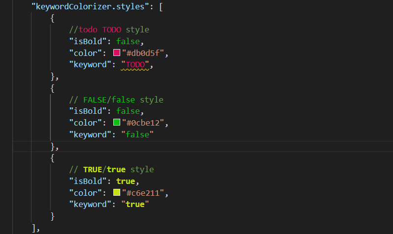
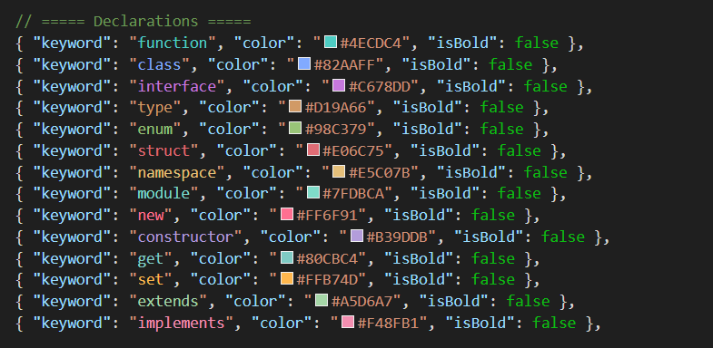
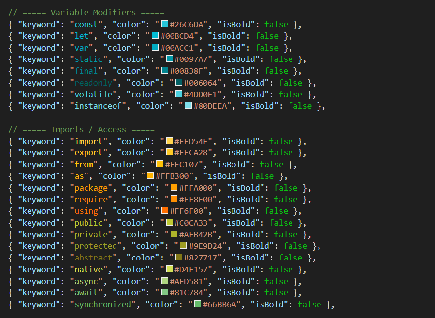
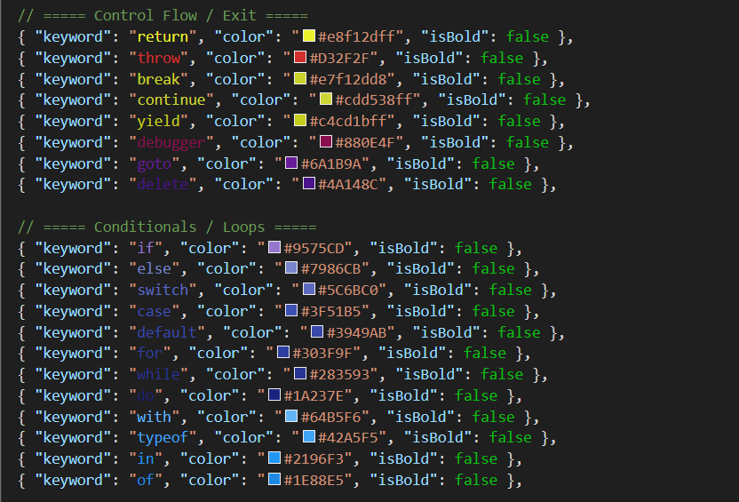

# Keyword Colorizer

**Keyword Colorizer** gives you full control over your syntax highlighting. Easily assign custom colors and font weights to specific keywords, variables, or patterns across your workspace.

Whether you want `return` statements to be bright red, or you need `TODO` comments to stand out in neon green, this extension lets you customize it directly from the VS Code Settings UI.

## Features

*   **Custom Colors:** Assign any hex color to any word.
*   **Bold Styling:** Toggle bold font weight for extra emphasis.
*   **Live Updates:** Colors update instantly as you type or change settings.
<!-- *   **Settings UI Support:** configure everything via dropdowns and color pickers—no JSON editing required. -->
*   **Language Agnostic:** Works in TypeScript, Python, C++, Java, Text, and more.

## How to Use
<!-- 
### Via Settings UI (Recommended)
1. Open VS Code Settings (`Ctrl + ,` or `Cmd + ,`).
2. Search for **Keyword Colorizer**.
3. Under **Keyword Colorizer: Styles**, click **Add Item**.
4. Enter the **Keyword** (e.g., `function`, `return`, `get`).
5. Pick a **Color** (hex code).
6. Check **Is Bold** if desired. -->

### Via settings.json
You can also configure it manually in your `.vscode/settings.json` or User Settings

### Current Defaults

